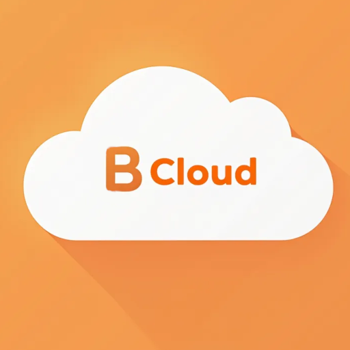

## Bcloud - A Home Cloud Console

This project aims to provide a simplified, cloud-like user interface for managing applications deployed on a local [k3s](https://k3s.io/) cluster.  It's designed to be a self-hosted "home cloud" solution, giving you the ability to deploy and manage containerized applications within your home network. The project itself is designed to run *on* the k3s cluster it manages, providing a unified deployment and management experience.

## Project Structure & Technology Overview

This is a monorepo project structured using Deno workspaces. It's divided into several key modules:

*   **`lib/`**: Contains shared library code, primarily TypeScript components and utilities, used by both the frontend and potentially backend services.
*   **`web/cloud-console/`**:  This is the primary frontend application, built with React, Vite, and TypeScript. It provides the user interface for interacting with the k3s cluster.
*   **`services/`** (Future): This directory will house backend services (when implemented), likely containerized and deployed to the k3s cluster. These services will handle tasks such as interacting with the Kubernetes API, managing deployments, and providing authentication/authorization.

**Key Technologies:**

*   **Deno:**  The core runtime and build system for both frontend and backend components. Deno's built-in tooling (linting, formatting, testing) and its focus on security and modern JavaScript features make it a good fit for this project.
*   **React:**  The frontend UI library, chosen for its component-based architecture and large ecosystem.
*   **TypeScript:**  Used throughout the project for static typing, improving code maintainability and reducing errors.
*   **Vite:**  A fast and modern build tool for the frontend, providing hot module replacement (HMR) for rapid development.
*   **k3s:**  A lightweight, production-ready Kubernetes distribution, ideal for home lab and edge deployments.  The entire project is designed to be deployed and managed *within* a k3s cluster.
*   **React Router:** Used for client-side routing within the web application.
*   **Tailwind CSS:** A utility-first CSS framework for rapidly building custom designs.
*   **PrimeReact:** A component library for React.
